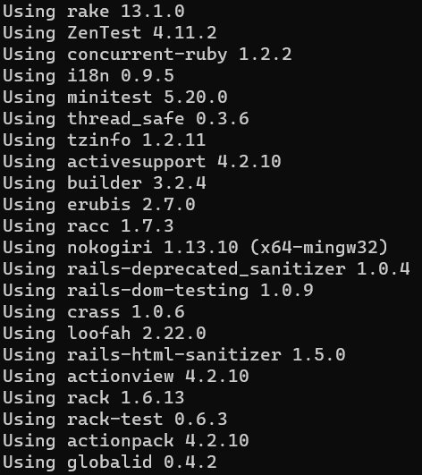
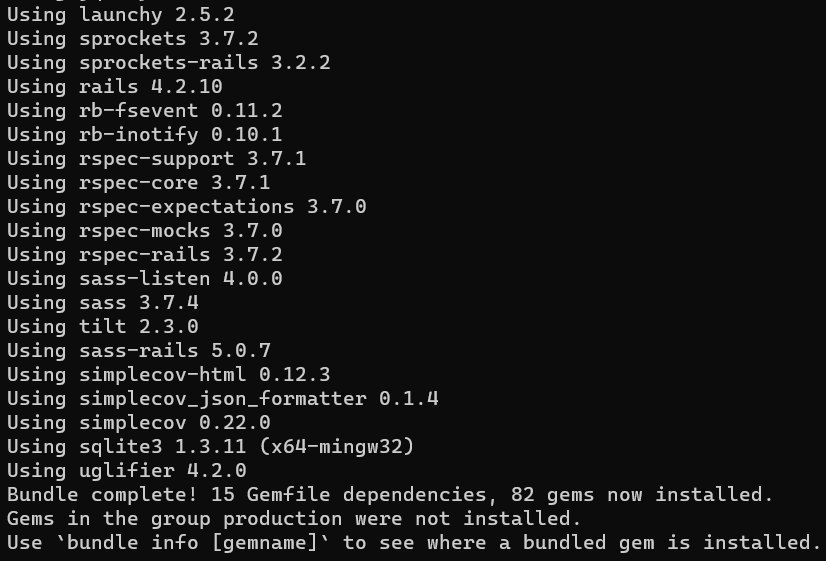
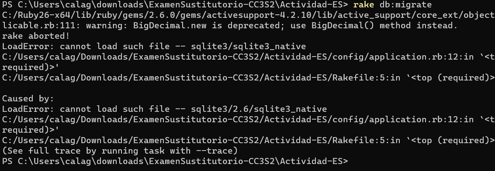
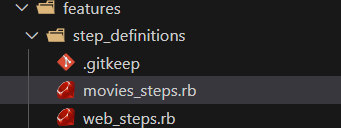
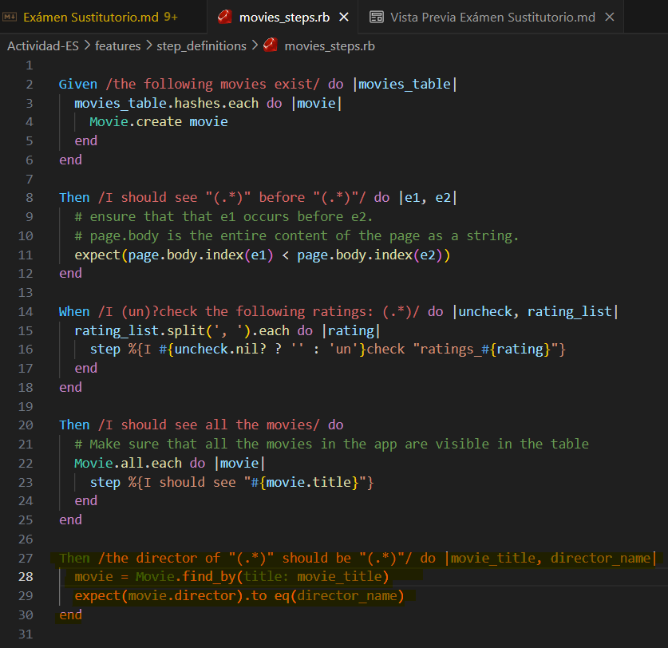
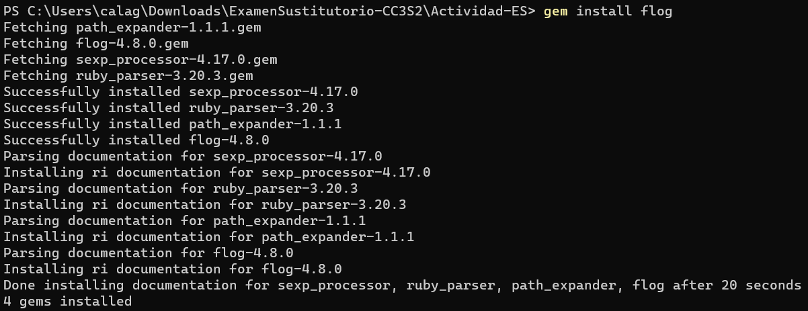

# Exámen Sustitutorio

## Parte 1: El ciclo de prueba de aceptación- prueba unitaria


Ejecutamos el siguiente comando:


y nos aparece lo siguiente:





Ahora creamos el esquema de base de datos inicial, así:



como podemos ver, me aparecen errores :(
  Después de mucho intentos fallidos (tantos que no entrarían aquí), sólo me queda continuar y no rendirme en que en el proceso de este exámen si se demuestre que conozco de los temas.

Entonces para el punto 4 que trata de agregar datos semilla se puede usar:

```
rake db:seed
```
Esto cargará los datos semilla que se tuvieron que definir en 'db/seeds.rb' en la base de datos

Para el punto 5 que trata de verificar la configuración de RSpec basta con ejecutar 'rspec', esto ejecutará todas nuestras pruebas de RSpec y nos debe mostrar los resultados en la consola.

Y finalmente, para el punto 6 que trata de verificar la configuración de Cucumber bastará con ejecutar 'cucumber', esto ejecutará nuestros escenarios de Cucumber y debe mostrar los resultados en la consola.

Ahora, según el documento del exámen, se nos mostrará errores de falla de Cucumber. El paso background debería fallar. El primer fallo de prueba en un escenario debería ser: Undefined step: the director of "Alien" should be "Ridley Scott".
Entonces se nos pregunta:
**¿Qué tendrás que hacer para solucionar ese erro específico?**
Respuesta: Ayuda mucho que sepamos cuál es el error porque así ya podemos plantear una solución. Entonces, lo que ahré será primero encontrar el archivo de definiciones de pasos que se encuentra en 'features/step_definitions':



Luego, dentro de este archivo, escribiré el código para asociar la declaración en el archivo de características con la lógica de prueba real, entonces lo siguiente puede funcionar:

```
Given /^the director of "([^"]*)" should be "([^"]*)"$/ do |movie_title, director_name|
  # Lógica para encontrar el director de la película en tu base de datos o donde sea que esté almacenada la información
  movie = Movie.find_by(title: movie_title)
  expect(movie.director).to eq(director_name)
end
```

Y quedaría así:



Para esta parte de código, 'Given' es la palabra clave asociada con el paso del escenario de Cucumber. La expresión regular '/^the director of "([^"]*)" should be "([^"]*)"$/' se usa para encontrar la declaración en la característica.

En el bloque del código, se busca la película por el título 'movie_title' y se espera que el director de esa película sea igual al nombre del director proporcionado 'director_name'.

## Parte 2: Ruby on Rails

### Pregunta 1:
**¿Por qué la abstracción de un objeto de formulario pertenece a la capa de presentación y no a la capa de servicios (o inferior)?**

Respuesta: Porque se trata de la representación visual y la interpretación con el usuario. En esta capa se maneja la presentación de datos y la captura de la entrada del usuario, como formularios en una interfaz gráfica.
Colocar esta abstracción en la capa de servicios rompería la separación de preocupaciones, ya que los servicios generalmente se enfocan en la lógica de acceso a datos no en la representación visual.

### Pregunta 2:
**¿Cuál es la diferencia entre autenticación y autorización?**

Respuesta: La autenticación se refiere al proceso de verificar la identidad de un usuario para asegurarse de que realmente sea quien dice ser, mientras que la autorización se trata de otorgar (o denegar) acceso a recursos específicos una vez que el usuario ha sido identificado.
Se puede deci, en otras palabas, que la autenticación verifica la identidad y la autorización controla qué recursos o acciones puede acceder o realizar un usuario autenticado.

### Pregunta 3:
**¿Qué pasa si omite el middleware de Rack y se pasa la solicitud al enrutador directamente (Rails.application.routes.call(request))? ¿Qué pasa si se omitie el enrutador y llamar a una acción del controlador de inmediato (por ejemplo, PostsController.action(:index).call(request))?**

Respuesta: Omitir middleware de Rack y llamar directamente al enrutador podría saltarse ciertas configuraciones y funcionalidades proporcionadas por el middleware, lo que podría afectar el flujo normal de manejo de solicitudes.
Igualmente, omitir el enrutador y llmar directamente a una acción del controlador podría evadir ciertas etapas de procesamiento que el enrutador realiza, como la resolución de la ruta y la aplicación de filtros o middleware específicos del controlador.

### Pregunta 4:
Con respecto a la complejidad: Podemos obtener la complejidad general de un sólo archivo así:

**flog -s app/models/user.rb**

Para ello, tal y como dce la documenttación, instalamos la gema flog:



Y al correr el comando, ya nos aparece lo siguiente:


## Parte 3: JavaScript

### Pregunta 1:


```javascript
// Función para leer una cookie por su nombre
function getCookie(name) {
  const cookies = document.cookie.split(';');
  for (let cookie of cookies) {
    const [cookieName, cookieValue] = cookie.split('=').map(c => c.trim());
    if (cookieName === name) {
      return cookieValue;
    }
  }
  return null;
}

// Función para crear una nueva cookie
function setCookie(name, value, days) {
  const date = new Date();
  date.setTime(date.getTime() + days * 24 * 60 * 60 * 1000);
  const expires = `expires=${date.toUTCString()}`;
  document.cookie = `${name}=${value};${expires};path=/`;
}

// Función para eliminar una cookie por su nombre
function deleteCookie(name) {
  document.cookie = `${name}=;expires=Thu, 01 Jan 1970 00:00:00 UTC;path=/;`;
}
// Valor inicial de documento.cookie
console.log(document.cookie); // Debería estar en blanco

// Intentar eliminar una cookie por su nombre
deleteCookie('miCookie'); // Se debe reemplazar 'miCookie' con el nombre de la cookie a eliminar
```
### Pregunta 2:

Según las indicaciones (pasos a seguir) del documento del exámen, se me está pidiendo que realice en javascript códigos que puedan dar solución a ciertos puntos, entonces planteo lo siguiente:

```javascript
// Seleccionar elementos del DOM
const form = document.forms['myform'];
const emailInput = form.elements['email'];
const passwordInput = form.elements['password'];
const userNameInput = form.elements['userName'];
const errorElements = document.querySelectorAll('.error');

// Detector de evento para enviar formulario
form.addEventListener('submit', function(event) {
  event.preventDefault(); // Evitar acción predeterminada del formulario

  // Ocultar todos los elementos de error
  errorElements.forEach(error => error.classList.add('hide'));

  let isError = false;

  // Expresión regular para correo electrónico válido
  const emailRegex = /^[^\s@]+@[^\s@]+\.[^\s@]+$/;

  // Función para manejar errores
  function error(element) {
    element.classList.remove('hide');
    isError = true;
  }

  // Validación del correo electrónico
  if (!emailRegex.test(emailInput.value)) {
    error(errorElements[0]);
  }

  // Validación de contraseña
  const passwordRegex = /^[a-zA-Z0-9]{3,8}$/;
  if (!passwordRegex.test(passwordInput.value)) {
    error(errorElements[1]);
  }

  // Manejo de errores y envío de formulario
  if (!isError) {
    const formData = {};
    for (let input of form.elements) {
      if (input.type !== 'submit') {
        formData[input.name] = input.value;
      }
    }
    console.log(formData); // Objeto con datos del formulario
    // Aquí podemos enviar el formulario
  }
});
```

### Pregunta 3:

**Extensión de la función de validación en ActiveModel para generar código JavaScript de validación de formulario**

```ruby
class Movie < ActiveRecord::Base
  validates :title, presence: true, length: { minimum: 1 }

end

# Generación automática de código JavaScript para validar el formulario
def generate_js_validation(model_class)
  validations = model_class.validators
  js_code = "<script>\n"
  
  validations.each do |validation|
    case validation.class
    when ActiveModel::Validations::PresenceValidator
      js_code += "if (!document.forms['myform']['#{validation.attributes[0]}'].value.trim()) {\n"
      js_code += "alert('Error: #{validation.attributes[0].to_s.capitalize} cannot be blank.');\n"
      js_code += "return false;\n}\n"
    when ActiveModel::Validations::LengthValidator
      js_code += "if (document.forms['myform']['#{validation.attributes[0]}'].value.length < #{validation.options[:minimum]}) {\n"
      js_code += "alert('Error: #{validation.attributes[0].to_s.capitalize} is too short.');\n"
      js_code += "return false;\n}\n"
    end
  end
  
  js_code += "</script>"
  js_code
end

# Uso de la función para generar código JavaScript de validación para el modelo Movie
movie_js_validation = generate_js_validation(Movie)
puts movie_js_validation
```

### Pregunta 4:
**Uso de objetos realies y dobles en pruebas de clases**

**¿Dónde podemos conseguir una instancia de Movie real para utilizarla en dicha prueba?**

Respuesta: Podemos cnseguir una instancia de Movie real para utilizarla en dicha prueba crerando un objeto a través del propio modelo Movie. Por ejemplo:

```ruby
real_movie = Movie.new(title: 'Casablanca', rating: 'PG')
expect(real_movie.name_with_rating).to eq 'Casablanca (PG)'
```
>Se debe notar que para los códigos de la última parte se tiene la seguridad (al igual que en otros exámenes) que estos cumplen con lo solicitado basándonos en lo pedido y en el orden al hacer los códigos como se nos enseñó en clase.